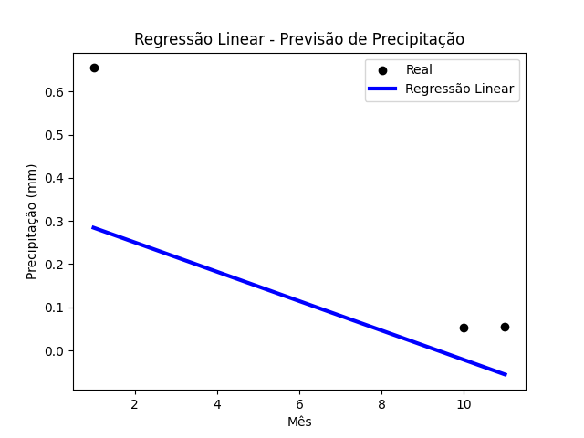

# Projeto de Previsão de Precipitação 🌧️
Este é um projeto simples de previsão de precipitação usando um modelo de regressão linear. O objetivo é demonstrar como utilizar o [scikit-learn](https://scikit-learn.org/stable/) (sklearn) para criar um modelo básico e visualizar os resultados.

## Conteúdo 📂

1. **Estrutura do Projeto**

   - `A.I Previsão de Chuvas.ipynb`: Jupyter Notebook contendo o código Python.
   - `INMET_CO_GO_A035_ITUMBIARA_01-01-2023_A_31-12-2023.CSV` e `MEDIA_MENSAL_2023_ITUMBIARA` : Conjunto de dados de exemplo com informações sobre o mês e a precipitação.

2. **Como Executar o Projeto** ▶️
   - Clone o repositório para sua máquina local.
   - Abra o notebook `A.I Previsão de Chuvas.ipynb` em um ambiente Jupyter.
   - Execute as células do notebook sequencialmente.
   

3. **Pré-requisitos** 🛠️
    - Python 3.x
    - Bibliotecas Python: pandas, scikit-learn, matplotlib
 
    
 **Você pode instalar as bibliotecas necessárias executando o seguinte comando no terminal:**

```bash pip install pandas scikit-learn matplotlib```

4. **Entendendo o Projeto** 🤓


   - **Conceitos Importantes** 🧠:
        - **Regressão Linear:** Modelagem da relação linear entre variáveis.
        - **sklearn:** Biblioteca de aprendizado de máquina em Python.
        - **Matplotlib:** Biblioteca para criação de gráficos.
     

   - **Passos Principais** 📝:
        - Carregamento e análise dos dados.
        - Divisão dos dados em treino e teste.
        - Criação e treinamento do modelo de regressão linear.
        - Avaliação do desempenho do modelo.
     

   - **Aviso** ⚠️:
        - Este é um projeto simples e os resultados podem não ser altamente precisos, pois o foco é na demonstração dos conceitos.


5. **Visualização do Resultado** 📊

     - No final do notebook, há um código para gerar um gráfico de dispersão mostrando os pontos reais e a linha de regressão linear.

```python
    import matplotlib.pyplot as plt


    # Exibir o gráfico
    plt.scatter(X_test, y_test, color='black', label='Real')
    plt.plot(X_test, previsoes, color='blue', linewidth=3, label='Regressão Linear')
    plt.xlabel('Mês')
    plt.ylabel('Precipitação (mm)')
    plt.title('Regressão Linear - Previsão de Precipitação')
    plt.legend()
    plt.savefig('grafico_regressao_linear.png')  # Salvar o gráfico como imagem
    plt.show()
```

6. **Visualização do Gráfico** 📈


   


7. **Entendendo o Gráfico** 📊

   - **O gráfico gerado visualiza a relação entre o mês (variável preditora) e a precipitação (variável de resposta). Aqui estão alguns pontos importantes sobre o gráfico:**

    - **Pontos Pretos (Real):** Cada ponto representa um par de valores no conjunto de teste. A coordenada x do ponto é o mês correspondente, e a coordenada y é a precipitação real para esse mês.

   - **Linha Azul (Regressão Linear):** A linha de regressão linear é ajustada pelo modelo. Ela representa a melhor estimativa da relação linear entre o mês e a precipitação com base nos dados de treinamento.

   - **Eixos X e Y:** O eixo X representa os meses do ano (de 1 a 12), enquanto o eixo Y representa a quantidade de precipitação em milímetros.

   
   - O gráfico proporciona uma visão visual de como o modelo se ajusta aos dados. Se a linha de regressão estiver alinhada com os pontos reais, sugere que o modelo está fazendo boas previsões. Caso contrário, pode indicar que o modelo não está se ajustando bem aos dados. A análise visual é complementada por métricas quantitativas como o MSE e RMSE, que fornecem uma avaliação mais detalhada do desempenho do modelo.
   
   
8. **Resultados do Modelo** 📊


   Após treinar o modelo de regressão linear, obtenha os seguintes resultados:

```python
print("Coeficiente de Regressão:", modelo.coef_[0]) # Coeficiente de Regressão: -0.03401075900496597
print("Intercepto:", modelo.intercept_) # Intercepto: 0.3183446041252269
print("Erro Quadrático Médio (MSE):", mse) # Erro Quadrático Médio (MSE): 0.05160596256947119
print("Raiz do Erro Quadrático Médio (RMSE):", rmse) # Raiz do Erro Quadrático Médio (RMSE): 0.2271694578271278
```
   - **Coeficiente de Regressão (`modelo.coef_[0]`):** O coeficiente de regressão é aproximadamente -0.034. Isso significa que, em média, espera-se uma diminuição de 0.034 mm na precipitação para cada aumento de um mês.
   

   - **Intercepto (`modelo.intercept_`):** O intercepto é cerca de 0.318. Representa o valor esperado da precipitação quando o mês é zero. No contexto deste projeto, a interpretação direta pode não ser relevante, pois o mês zero não existe.


   - **Erro Quadrático Médio (MSE):** O MSE é 0.0516, representando a média dos quadrados das diferenças entre as precipitações reais e as previstas. Quanto menor, melhor é o desempenho do modelo.

   
   - **Raiz do Erro Quadrático Médio (RMSE):** O RMSE, calculado como a raiz quadrada do MSE, é aproximadamente 0.227. Ele fornece uma interpretação mais intuitiva dos erros do modelo. Neste contexto, indica que, em média, a precipitação real pode variar cerca de 0.227 mm das previsões.
    

9. **Observações Finais** 🌟
- **Este projeto serve como uma introdução simples à construção de modelos de previsão usando regressão linear. Experimente e adapte conforme necessário, explorando modelos mais avançados e técnicas para aprimorar suas habilidades em aprendizado de máquina.**
